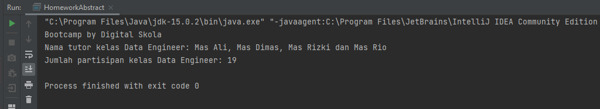
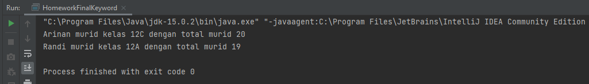
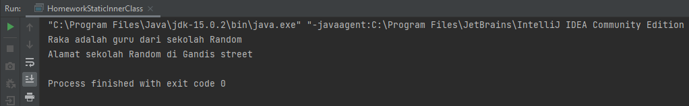
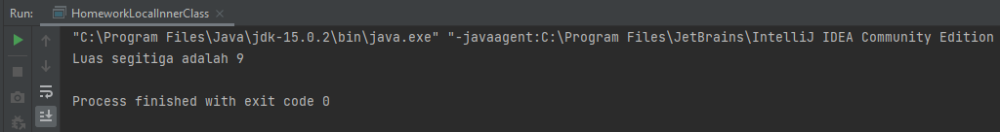
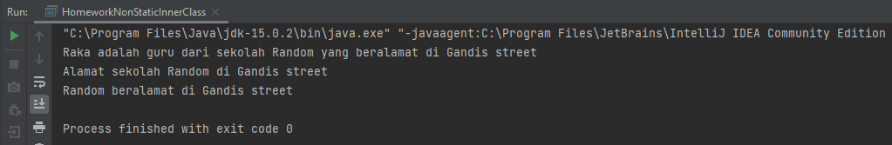
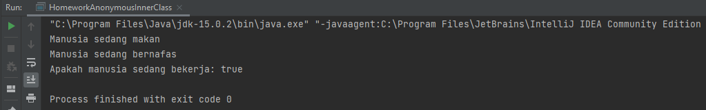
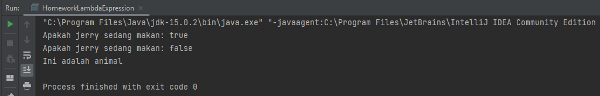

# Homework Advanced Class Design Java

## Output
### Abstract Class & Method

### Final Keyword

### Inner Class
#### Static Inner Class

#### Local Inner Class

#### Non-Static Inner Class

#### Anonymous Inner Class

### Lambda Expression

